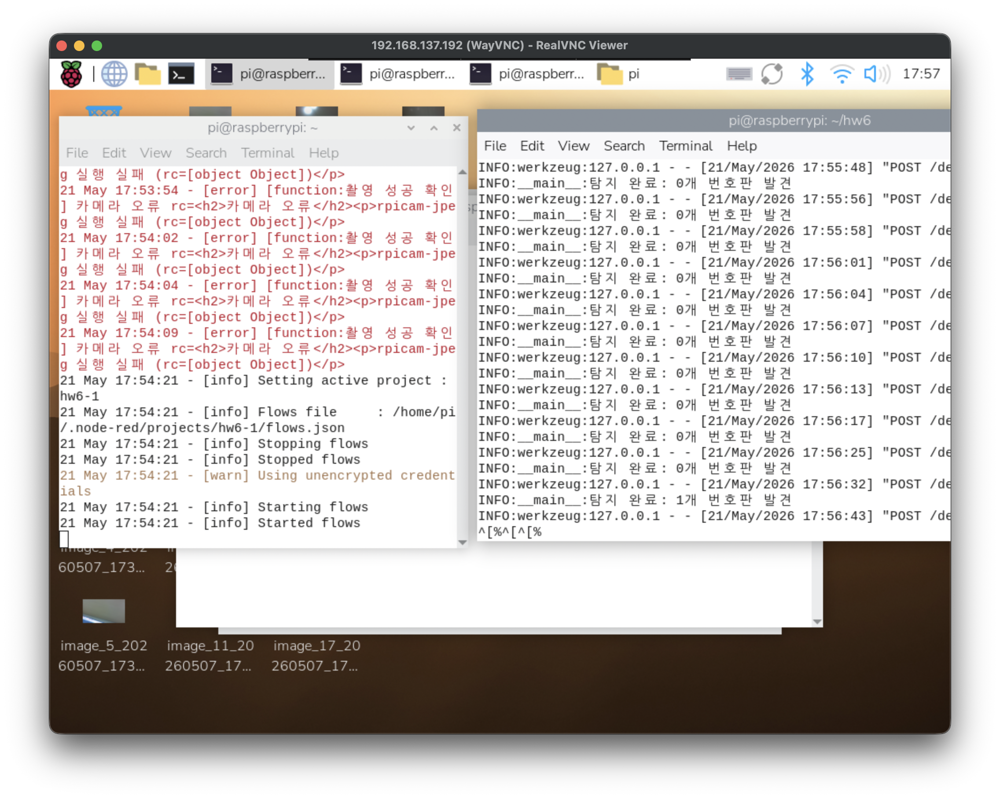
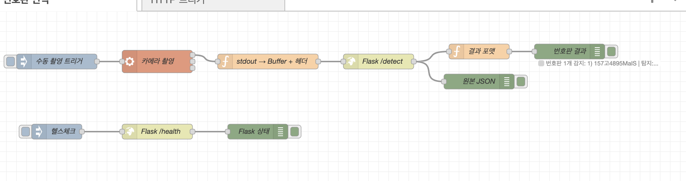

# IoT26-HW06: License Plate Recognition with Raspberry Pi, Node-RED & YOLOv8

## 1. Project Overview

This assignment builds a license plate recognition system by combining Node-RED's Raspberry Pi Camera integration with a custom YOLOv8 + EasyOCR Flask API. Node-RED captures a photo via the Pi Camera Module and sends it to the Flask server (`hw6.py`) running on port 5000. The server detects license plates using a YOLOv8 model fine-tuned for plate detection (`keremberke/yolov8n-license-plate-detection`), then reads the plate text using EasyOCR (Korean + English). The result is returned as JSON and displayed on the Node-RED dashboard.

**System Flow:**

```
[Node-RED Dashboard Button]
        ↓
[camerapi takephoto node]  →  photo1.JPEG saved
        ↓
[http request node]  →  POST /detect  →  [hw6.py Flask API]
        ↓                                        ↓
[Node-RED Dashboard]  ←  plate text + confidence (JSON)
```

## 2. Execution Screenshots

**Node-RED Flow & Dashboard:**





## 3. Working Video

GIF Preview:


## 4. Main Source Code

**hw6.py** — YOLOv8 + EasyOCR Flask API server:

```python
import cv2
import easyocr
import numpy as np
from flask import Flask, jsonify, request
from ultralytics import YOLO

app = Flask(__name__)

MODEL_NAME = "keremberke/yolov8n-license-plate-detection"
CONFIDENCE_THRESHOLD = 0.4

model = YOLO(MODEL_NAME)
ocr_reader = easyocr.Reader(["ko", "en"], gpu=False)

def decode_image(data: bytes) -> np.ndarray:
    arr = np.frombuffer(data, dtype=np.uint8)
    img = cv2.imdecode(arr, cv2.IMREAD_COLOR)
    if img is None:
        raise ValueError("이미지 디코딩 실패")
    return img

def run_ocr(img: np.ndarray, bbox: list) -> tuple[str, float]:
    x1, y1, x2, y2 = [int(v) for v in bbox]
    pad = 4
    h, w = img.shape[:2]
    x1, y1 = max(0, x1 - pad), max(0, y1 - pad)
    x2, y2 = min(w, x2 + pad), min(h, y2 + pad)
    crop = img[y1:y2, x1:x2]
    results = ocr_reader.readtext(crop, detail=1)
    if not results:
        return "", 0.0
    texts = [r[1] for r in results]
    confidences = [r[2] for r in results]
    best_conf = max(confidences)
    combined_text = "".join(texts).replace(" ", "")
    return combined_text, round(best_conf, 4)

@app.route("/detect", methods=["POST"])
def detect():
    if request.content_type and "multipart" in request.content_type:
        image_bytes = request.files["image"].read()
    else:
        image_bytes = request.get_data()

    img = decode_image(image_bytes)
    results = model(img, conf=CONFIDENCE_THRESHOLD, verbose=False)

    plates = []
    for result in results:
        for box in result.boxes:
            bbox = box.xyxy[0].tolist()
            det_conf = round(float(box.conf[0]), 4)
            text, ocr_conf = run_ocr(img, bbox)
            plates.append({
                "text": text,
                "detection_confidence": det_conf,
                "ocr_confidence": ocr_conf,
                "bbox": [int(v) for v in bbox],
            })

    return jsonify({"success": True, "plates": plates, "count": len(plates)})

@app.route("/health", methods=["GET"])
def health():
    return jsonify({"status": "ok"})

if __name__ == "__main__":
    app.run(host="0.0.0.0", port=5000, debug=False)
```

## 5. How to Run

**1. Install dependencies**
```bash
pip install flask ultralytics easyocr opencv-python-headless
sudo npm install -g node-red-contrib-camerapi
```

**2. Start the Flask API server**
```bash
python hw6.py
```

**3. Import Node-RED flow**
- Import `flows.json` into Node-RED
- Deploy and access the dashboard at `http://<RPI_IP>:1880/ui`

**4. Use**
- Click the **Take a Photo** button on the dashboard
- The image is automatically sent to the Flask API
- Detected plate text and confidence score are displayed on the dashboard
